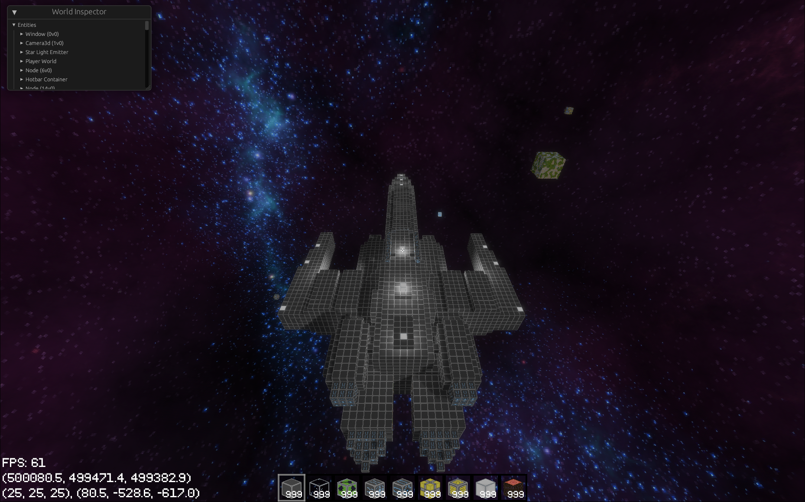

# Cosmos

A multiplayer block-based space exploration game, written in rust using the [Bevy](https://www.bevyengine.org/) engine.

If you're interested, join our new discord server here:
[](https://discord.gg/VeuqvnxsZb)

## Screenshots

Cosmos is a game where you can create your dream spaceship that you can pilot through space. (And add those are working laser cannons.)


Build your own ship block by block and walk inside with friends while cruising through space.


Once you reach your destination, make a _hopefully safer than this_ landing.


## Compilation

To get started, install your OS dependencies [here](https://bevyengine.org/learn/book/getting-started/setup/#install-os-dependencies). The dependencies section is all you need to do.

This project requires the latest nightly rust to compile. To swap to nightly, run the command

`rustup default nightly`.

To run the client, navigate to the cosmos_client directory and run

`cargo run`

For the server, navigate to the cosmos_server directory and run

`cargo run`

For release builds, append the `--release` flag to the build/run commands.

## Documentation

The first time you view the cosmos documentation, run the following commands

```console
cargo install mdbook
cargo install mdbook-mermaid
```

Every time you want to view the documentation, navigate to the `docs/` directory. To have it update as you modify it, run `mdbook serve` and navigate to the URL it provides, or to just build it run `mdbook build`.

# Cosmos Roadmap

See [the issues page](https://github.com/AnthonyTornetta/Cosmos/issues) for the list of current features/bugs in development.

## Release 0.0.5a - The Aesthetic Release (In Progress)

- [ ] Biosphere Improvements
  - [ ] Ice biosphere glaciers
  - [ ] Water block
  - [ ] Lava block
  - [ ] Structures
    - [ ] Rocks spawning
    - [ ] Undergrowth
    - [ ] 1 More tree type
  - [ ] Groundwork for biomes
    - [ ] Plane,
    - [ ] Redwood forest,
    - [ ] 1 Additional forest
    - [ ] Ocean
  - [ ] On-planet skybox
    - [ ] Sun-side skybox
      - [ ] Perhaps done via a sphere surrounding the planet that always faces the nearest star
    - [ ] Sun-set skybox
    - [ ] Night-side skybox
- [x] Animated textures
- [x] Sounds
  - [x] Laser cannon fire
  - [x] Block take damage
  - [x] Thrusters moving
  - [x] Space ship idle
  - [x] Background space music
  - [x] Block place/break
- [ ] Place rotated blocks
- [x] Multiblock machines
  - [x] Revamp power generation to use reactor multiblock structure
- [x] Colored laser
  - [x] Colored glass placed in front of laser
- [x] Inventory GUI
  - [x] Able to open inventory
  - [x] Abstract the 3d block GUI camera
  - [x] Fix the 3d block GUI camera to not render anything except GUI blocks
- [x] Fix seeing through cracks in blocks
- [x] Lods
  - [x] Reduced detail rendering of far away chunks to see the entire planet
- [x] Update to bevy 0.11
  - [x] Update physics
  - [x] Update bevy
- [x] GUI to interact with inventory
  - [x] Easier way of adding 3d blocks to GUI
  - [x] Move items around in inventory via mouse
- [x] Structure build mode
  - [x] Interact with build block to enter build mode
  - [x] Build mode
    - [x] Camera becomes a noclip free cam and goes outside of player's body.
    - [x] Player no longer piloting ship, & is able to create + destroy blocks on the ship but ONLY the ship
    - [x] Symmetry modes are added that will mirror blocks on user-defined axis

## Release 0.0.4a

- [x] Galaxy Generation
  - [x] Stars procedurally generated in spiral-like pattern based on seed
    - [x] Create star
      - [x] Light emits from star
      - [x] Load star within system
  - [x] Planets generate around stars
    - [x] Biospheres depend on how close they are to the sun
    - [x] Dynamic biospheres based off temperature
    - [x] Only generate if planet is close enough to player
    - [x] Cube planets
      - [x] Planets will now be cubes instead of flat planes, and will be about the size of the sector
      - [x] Redo saving/loading of planets
      - [x] Dynamically generate chunks & unload them based on players' positions close to planet
      - [x] Make generation work on all faces of planet
      - [x] Block orientation for every block
  - [x] Biospheres
    - [x] Speed up terrain generation
    - [x] Make molten biosphere
    - [x] Enhance grass biosphere
    - [x] Create icy biosphere
  - [x] Asteroids
    - [x] For now just floating rocks in space
  - [x] Save generated universe
    - [x] Save planet locations
  - [x] Fix broken ship functionality
    - [x] Make entities no longer pass through loading structures.
- [x] Align body with structure
  - [x] Switches to FPS Camera
  - [x] Aligns the player to that structure
    - [x] Fix child locations being not updated based on transform relative to parent
  - [x] Add button to align to structure facing
  - [x] De-align, switch back to free camera
    - [x] Create free camera

## Release 0.0.3a

- [x] Infinite universe
  - [x] (**Client**) Player can travel any distance from 0,0,0 with no noticable issues, and everything moves relaitve to player
  - [x] (**Server**)
    - [x] Objects move relative to player world they are a part of
    - [x] Player world moves relative to its player
    - [x] Players can be a part of the same world if they are close enough
    - [x] Requires rewrite of bevy_rapier to support multiple physics worlds
      - [ ] Merge PR https://github.com/dimforge/bevy_rapier/pull/328
- [x] Update to bevy 0.10.0
- [x] Performant ships
  - [x] Ability to have 50 small-sized ships loaded with minimal performance impact
- [x] Dynamic object loading
  - [x] (**Client**)
    - [x] Unload objects that are too far away
    - [x] Request entities that server sends if they don't have the entity for them
  - [x] (**Server**)
    - [x] Unload objects that are too far from any player
    - [x] Load objects that are close to a player & send that info to client
    - [x] Only send information about objects to clients that are close enough to have them loaded
- [x] Display coordinates in top left (sector, local)
- [x] Revamp rendering to allow for more than cubes
- [x] Display hotbar items
  - [x] 3d models for blocks

## Release 0.0.2a

- [x] Improved state management
  - [x] Client state management
  - [x] Server state management
  - [x] Core able to utilize both states
    - [x] Block resource loaded in PreLoading state
    - [x] Blocks loaded in Loading state
    - [x] Systems loaded in PostLoading state
- [x] Ability to pilot Ship
  - [x] Mouse movements steer ship around ship core
  - [x] Standard movement controls mapped to ship acceleration
  - [x] Interact with ship core to enter piloting mode, press interact button again to exit
  - [x] Create max ship speed
- [x] Ship core
  - [x] Interact with this block to pilot the ship
  - [x] Cannot be mined while other blocks are present on the ship
  - [x] Create block
- [x] Localized planetary gravity
  - [x] All entities near planet's radius are subject to its gravity towards its relative downward vector
    - [x] The gravitational pull should scale inversely exponentially the farther the distance from a certain threshold (most likely the highest chunk) then remain constant past that point
- [x] Ship systems
  - [x] Energy system
    - [x] Energy producer block
    - [x] Energy storage block
    - [x] Energy storage system
    - [x] Energy generation system
  - [x] Thruster system
  - [x] Thruster block
  - [x] Allows the ship to move + rotate
    - [x] Faster movement based on # of thrusters
    - [x] Faster rotation based on # of thrusters
    - [x] More energy consumption per thruster
  - [x] Laser cannon system
    - [x] Laser cannon block
      - [x] Can be placed in lines to create more powerful lasers
    - [x] Click lmb/hold to fire the laser
      - [x] The laser is on a cooldown
  - [x] Ship hull block
- [x] Ability to place more than one block
  - [x] Hotbar
    - [x] Rendering of hotbar
    - [x] Reads items from inventory
  - [x] Inventory
  - [x] Items
    - [x] Item stacks
  - [x] Way of select which item
- [x] Store block damage
- [x] Ability to save ships to disk + load them
  - [x] Implement console commands

## Release 0.0.1a

- [x] Player Movement
  - [x] FPS Camera
- [x] Dynamic Input system
- [x] Structure
  - [x] Planet
  - [x] Ship
- [x] Asset Loading
  - [x] Fix UV mapping floating point errors
- [x] Planet Generation
  - [x] Grass planet generator
- [x] Server/Client
  - [x] Server controls planet
  - [x] Each player controls its own movement (100% trusted)
- [x] Ship creation
- [x] Block registration
  - [x] Block registry with numeric + fixed string IDs
- [x] Player entity
- [x] Game State
- [x] Network communication
- [x] Sync bodies from server to client
- [x] Ability to break/replace block
  - [x] Dynamic meshing
  - [x] Dynamic physics bodies
  - [x] Block break events sent to server, server sends back block changed event
  - [x] Selects nearest structure
- [x] Integrate physics system
  - [x] Physics generator for structures
    - [x] Chunk-based physics
  - [x] Player collider
- [x] Integrate bevy engine
  - [x] Rendering method for structures
    - [x] Chunk-based rendering
- [x] Add Crosshair
- [x] Support re-sizable window

## Everything that will still have to be done after 0.0.5a

- [ ] Mining beam system
  - [ ] Mining beam block
    - [ ] Can be placed in line to create more powerful miners
  - [ ] Mines the first block hit by the beam after a given time
    - [ ] Inserts the item into the ship's inventory
    - [ ] Hold lmb to continually fire the laser
  - [ ] Structure gets deleted when no more blocks are left
- [ ] Storage system
  - [ ] An interface into all the storage devices on the ship
- [ ] A way of selecting which systems to use preventing use of systems that are not meant to be actively used
- [ ] Dropped item entity
- [ ] Storage block
  - [ ] A block that stores an amount of items
  - [ ] Can be interacted with to view the items
    - [ ] A GUI to view items
- [ ] Camera system
  - [ ] Camera block
  - [ ] Use left/right to switch between ship cameras
    - [ ] Changes where your view is
- [ ] Shops
  - [ ] Sell blocks/items
  - [ ] Buy blocks/items
  - [ ] Generates randomly
    - [ ] Implement random structure Generation
  - [ ] Prices based on supply + rarity
    - [ ] Keep supply relatively equal between nearby shops
  - [ ] Each shop has its own supply of money that it cannot go below
  - [ ] Implement currency system for player
    - [ ] Money GUI
    - [ ] Pay others
  - [ ] Shop GUI
