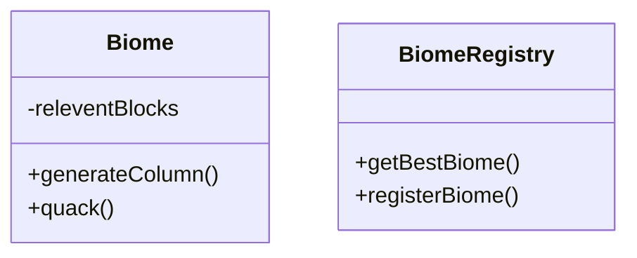

# Biomes (under construction 🚧)

```mermaid
classDiagram
    class Biome {
        -releventBlocks
        +generateColumn()
        +quack()
    }

    class BiomeRegistry {
        +getBestBiome()
        +registerBiome()
    }
```
