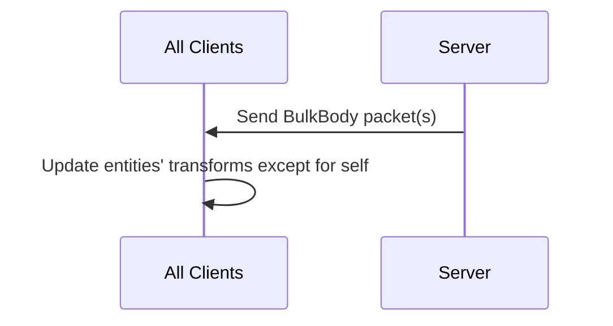

# Bulk Bodies packet

**Packet**: ServerUnreliableMessages::BulkBodies

**Channel**: NettyChannelServer::Unreliable

## Abstract

Server &rarr; Client

Packets are sent every update by the server.

The server sends a packet to every client, who then updates those entities' transforms to match the data in this packet. The only exception is if a client receives itself, it will not update its own position because this causes jitter for the player if they have a high ping. 

In the future, this should also account for the time difference between receiving the packet and the client's own time to avoid jittering.

Multiple packets may be sent per frame for different groups of entities to not make any one packet too big.

## Diagram

