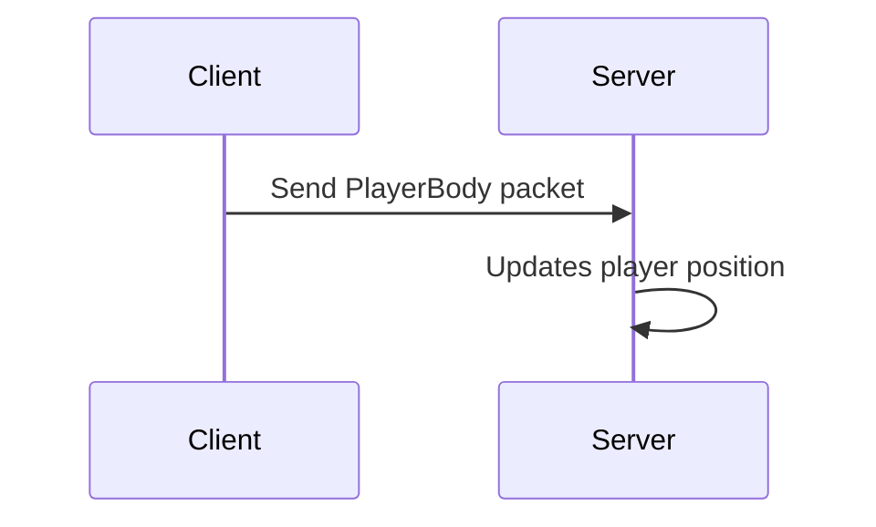

# Player movement packets

**Packet**: ClientUnreliableMessages::PlayerBody

**Channel**: NettyChannel::Unreliable

## Abstract

Client &rarr; Server

**This is a client-authoritative interaction.** In the future, the server will become the authoritative one. Packets are sent every update by the client.

The client sends a packet to the server, which then updates that player's position and updates every client on its position. The client that sends the packet is authoritiative on where it is located.

The server does not immediately update all players of that clients, location but rather does it in a [BulkBodies packet](/packets/bulk-bodies.md).

## Diagram

