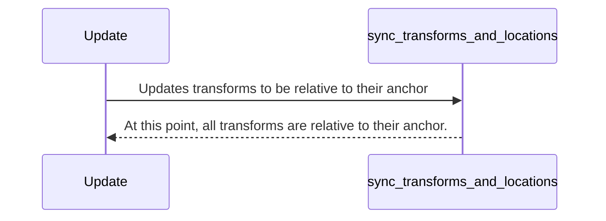
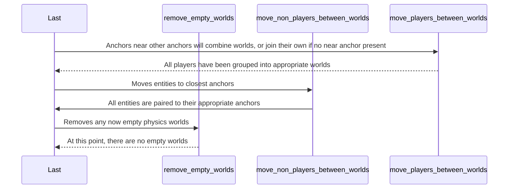

# Anchor

## Intent

**Anchors** are a way of making transforms relative to a specific entity to ensure floating point precision isn't a problem. 

## :( Problem

In a normal game, all positions are based on an absolute `0, 0, 0`. This is fine in games where players don't travel far from the origin of the world. In Cosmos, of course, players can travel billions or even trillions of kilometers away from `0, 0, 0`. This leads to the breakdown of floating point numbers as a unit and makes the game completely unplayable. In bevy, subtle issues start to arise as early as 20,000 blocks away from the origin in any direction.

## :) Solution

Instead of basing all the world positions around a fixed `0, 0, 0`, have that origin move with the player. This player could then be called for more clarity, an **Anchor**.  This would ensure that floating point calculations are most accurate close to the player, and less accurate farther away from the player where inaccuracies are not noticeable.

But wait... what about multiple players? Which one is the origin?

### Client

For the client, this isn't a problem at all. The client doesn't have to care how other players view the world, so the client can always assume its player is the origin. This saves it from having to consider the needs of others.

### Server

The server, in contrast to the client, has to love everyone equally. This leads to a more complex solution. 

To make sure each player has a good experience, the server simply separates each player into their own "Physics World", thus making each player an anchor. A Physics World is simply a sandbox where nothing in that world affects any others. This means, that if something in world "A" is at `0, 5, 0`, and something in world "B" is also at `0, 5, 0`, they will not interact with each other at all.

Once each player is in their own world, it's as simple as assigning each non-anchor entity to the anchor closest to them, basing their positions off that and putting them in that anchor's physics world. 

Of course, this introduces a new issue - what about players that are close or next to each other? 

The simplest fix to this issue is to have a check for anchors that are near each other. Once an anchor (A) is too close to another (B), A's status as an anchor is revoked and it becomes a part of B's world. All the entities that were part of A's world are also moved into B's world. 

When a player moves too far away from its anchor, it is once again put into its own world and treated as an anchor.

## Diagram

### Update Schedule (Both client + server)

### Last Schedule (Only server)

