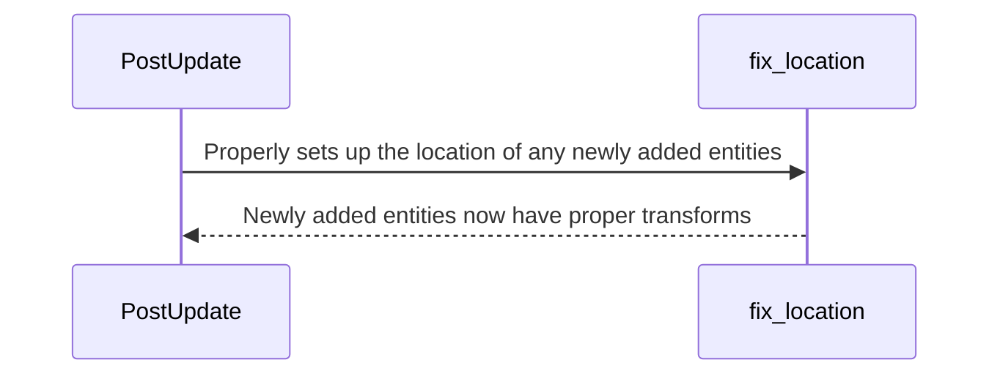

# Location

## Intent

**Locations** represent an entity's absolute coordinates in all three x/y/z axes within a range of about -19,498,223 to 19,498,223 light years.

## :( Problem

In a normal game, all x/y/z positions are stored as `f32` values. While floating point precision errors are resolved by
the [Anchor](./anchor.md) pattern, we still need a way of representing your absolute position in space.
`GlobalTransform` positions are relative to their specific Anchor, so these wouldn't give an absolute world position.
In addition, the values of a GlobalTransform wouldn't be nearly big enough to store the possible coordinates of an entity.

## :) Solution

The Location structure stores your absolute position by breaking your position into two representations - sector coordinates
and local coordinates. Sector coordinates represent how far away you are from `0, 0, 0` in multiples of 20,000. A sector coordinate
of `(4, 0, -3)` is the same as `(80,000, 0, -60,000)`. The local coordinates are used to store an offset from the sector coordinate grid.
For example, sector coordinates `(1, 0, 0)` with local coordinates `(5000, 1000, -4000)` would represent an absolute position of `(45000, 1000, -4000)`.

By using locations to compare entities instead of their transforms, you will get correct measurements even over extremely long distances
and short distances. Because of this, you should generally prefer to use the Location structure over the Transform or GlobalTransform.

This means that when adding an entity to the world, it is generally a good idea to instead add a Location rather than a TransformBundle.
For ease of use, a `CosmosPbrBundle` has been provided that works the same as a normal `PbrBundle`, except it takes a location instead of a transform.

To make sure the transform &amp; location remains accurate, they are synced every frame. The below diagrams show this process.

`Location` and `Transform` components are automatically kept in sync with each other, meaning you can change both in a single frame, and they will
update each other properly.

## Location Flow

There are two ways you would want to add or modify an entity's `Location`.

The `SetPosition` component is used as a flag to indicate the source of truth for the `Entity`'s position for a single frame. This is most useful when first
spawning an `Entity`.

### Location-Dominant

In this case, you want the `Location` to set the `Transform` of the entity. Insert the `SetPosition::Location`
component to the entity to signify the [`Location`] should be used as the source of truth this frame. The `Transform` of the entity
will be updated to match the `Location` component. After the `Transform` is set to match this `Location`, the `SetPosition` component will be removed.

### Transform-Dominant

In this case, you want the `Transform` to set the `Location` of this entity. Insert the `SetPosition::Transform`
component to the entity to signify the [`Transform`] should be used as the source of truth this frame. The `Location` of the entity
will be updated to match the `Transform` component. After the `Location` is set to match this `Transform`, the `SetPosition` component will be removed.

### SetPosition

## Diagrams

### Location + Transform Syncing

This takes place within the `Update` schedule, in the `DoPhysics` set.

```mermaid
sequenceDiagram
    Between->>apply_set_position:
    apply_set_position->>sync_transforms_and_locations:
    sync_transforms_and_locations->>handle_child_syncing:
    handle_child_syncing->>add_previous_location:
    add_previous_location->>Between:

sequenceDiagram
    Update->>fix_location: Properly sets up the location of any newly added entities
    fix_location-->>Update: New entities now have proper locations
    Update->>sync_transforms_and_locations: Applies transform changes to the location, and location changes to the transform
    sync_transforms_and_locations-->>Update: Syncing for all top-level entities is done
    Update->>handle_child_syncing: Syncs entities that have parents' locations and transforms by applying transform changes to the location & location changes to the transform
    handle_child_syncing-->>Update: Entities with parents are now properly synced
    Update->>add_previous_location: The new locations created from this are now set to be the previous location, so the above systems can properly track changes
    add_previous_location-->Update: Everything is complete, and transforms + locations are now in-sync.
```

### Post Update Schedule



These diagrams are based off the systems added in `cosmos_server/src/physics/mod.rs` and `cosmos_client/src/physics/mod.rs`.

20,000 is the number at the time of this document's writing. For an always accurate number, you should refer to the `SECTOR_DIMENSIONS` constant in `cosmos_core/src/physics/location.rs`.
