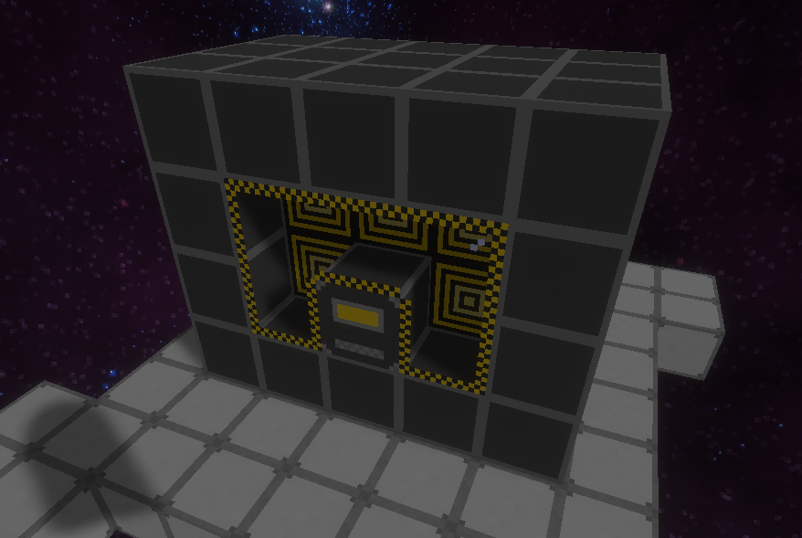

# Energy

Many things on a ship will require energy to function. There are two energy properties a ship will have:

1. Energy Generation
2. Energy Storage

If you have many things drawing power, you will likely need to increase your storage, as well as energy generation.

## Passive Energy Generator

These are great for small ships that don't require a lot of power to be generated quickly. Though small in generation amounts, these do generate energy indefinitely once placed.

## Energy Cell

Each Energy Cell can store a large amount of energy. These are essential when using many different power drainers at the same time, or storing large amounts of energy for bursts of power usage.

## Reactor

You will quickly find passive energy generators to be insufficient for your needs. Reactors are the next tier of generation, but do require fuel to function.

#### Construction

Reactors are a multiblock structure, requiring at least a 3x3x3 space, to a maximum of 11x11x11.
You will need

1. Enough Reactor Casing/Reactor Window to surround the fuel cells
2. Fuel Cells to be placed inside the casing
3. A single reactor controller

Place fuel cells, surrounded by a container of reactor casing and windows. Place one controller, making sure the controller face is facing outward.

An example reactor can be seen here:

#### Fuel

Uranium Fuel Cells can be placed in the Reactor Controller to be used as fuel.

#### Operation

The more fuel cells you add to the reactor, the more power the reactor will generate at the cost of faster fuel consumption. You need to interact with the reactor controller and activate it once you are ready to start generating power.
